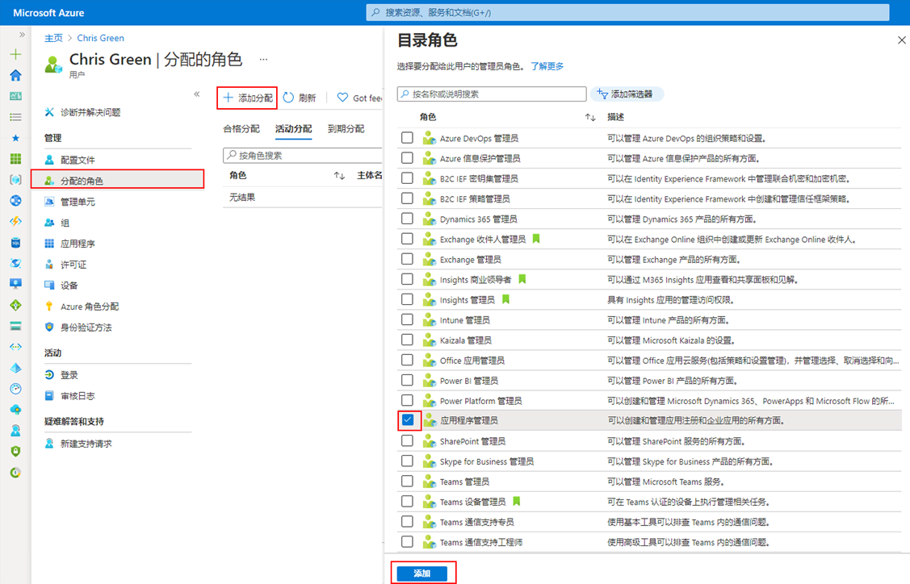
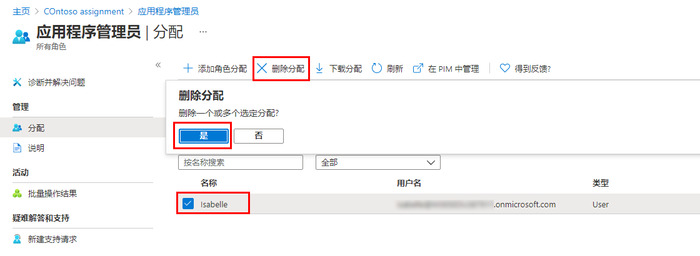

---
lab:
    title: '01 练习 - 管理用户角色'
    learning path: '01'
    module: '模块 01 - 实现标识管理解决方案'
---

# 实验室 01：管理用户角色

## 实验室场景

你的公司最近雇佣了一名新员工，其职责是应用程序管理员。你必须创建一个新用户并分配合适的角色。

#### 预计用时：10 分钟

## 创建 Azure 帐户并添加 Azure Active Directory Premium P2 试用版许可证

本练习中的任务和本学习路径中的练习要求你已拥有可使用的 Azure 订阅，或注册 Azure 试用帐户。如果已有自己的 Azure 订阅，则可以跳过此任务并继续下一步。

1. 在 Web 浏览器中，转到 [https://azure.microsoft.com/free](https://azure.microsoft.com/free)。

1. 向下滚动页面以了解有关好处和可用免费服务的详细信息。

1. 选择 **“免费开始”**。

1. 使用该向导注册 Azure 试用版订阅。

1. 需要 Azure AD P2 许可证才能完成某些练习。在所创建的组织中，搜索并选择 **“Azure Active Directory”**。

1. 在左侧导航菜单中，选择 **“开始”**。

1. 在“Azure AD 入门”下，选择 **“获取 Azure AD Premium 的免费试用版”**。

1. 在“激活”窗格中的 **“AZURE AD PREMIUM P2”** 下，选择 **“免费试用版”**，然后选择 **“激活”**。

1. 在左侧的导航菜单中，选择 **“概述”**。

1. 刷新浏览器，直到组织名称下显示 “Azure AD Premium P2”。这可能需要几分钟时间才能完成。

1. 如果遇到预期功能不可用之类的任何问题，则可能需要注销并重新登录 Microsoft Azure。

## 添加新用户

现在，让我们创建一个用户帐户。

1. 以全局管理员身份登录到 [https://portal.azure.com](https://portal.azure.com)

1. 搜索并选择 **“Azure Active Directory”**。

1. 在左侧导航菜单中的 **“管理”** 下，选择 **“用户”** > **“新建用户”**。

1. 使用以下信息创建用户：

    | **设置**| **值**|
    | :--- | :--- |
    | 用户名| Chris|
    | 姓名| Chris Green|
    | 名字| Chris|
    | 姓氏| Green|
    | 密码| Pass@word1|

1. 选择 **“创建”**。现已创建用户并注册到你的组织。

## 向用户分配角色

借助 Azure Active Directory (Azure AD)，你可以指定受限管理员来管理权限较低角色中的标识任务。可以分配管理员以执行添加或更改用户、分配管理角色、重置用户密码、管理用户许可证、管理域名等任务。

1. 在 Azure Active Directory 中的“所有用户”边栏选项卡下，选择 **“Chris Green”**。

1. 在 **“用户个人资料”** 页上，选择 **“分配的角色”**。随即会显示 **“已分配的角色”** 页。

1. 选择 **“添加分配”**，选择 **“应用程序管理员”** 角色，然后选择 **“添加”**。

    

新分配的应用程序管理员角色显示在用户的 **“分配的角色”** 页中。

## 删除角色分配

如果需要删除用户的角色分配，也可通过 **“分配的角色”** 页执行该操作。

1. 在 **Azure Active Directory** 中，选择 **“用户”**，然后选择需要删除其角色分配的用户。例如，选择 *“Chris Green”*。

1. 选择 **“分配的角色”**，然后选择要删除的角色名称。

1. 选择要从该角色中删除的用户的复选框，然后选择 **“删除分配”**。

    

“应用程序管理员”角色随即将从该用户中删除，并且不会再出现在 **“Alain Charon - 分配的角色”** 页面中。

