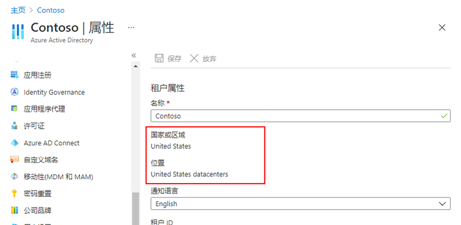
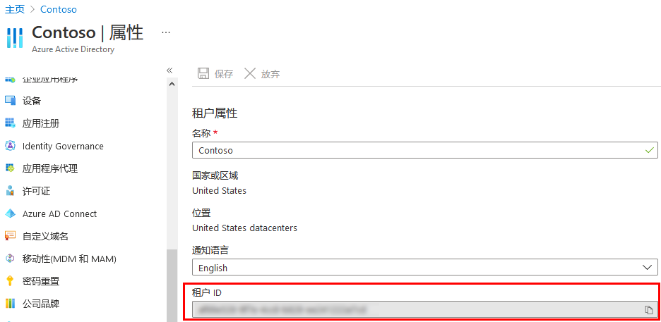
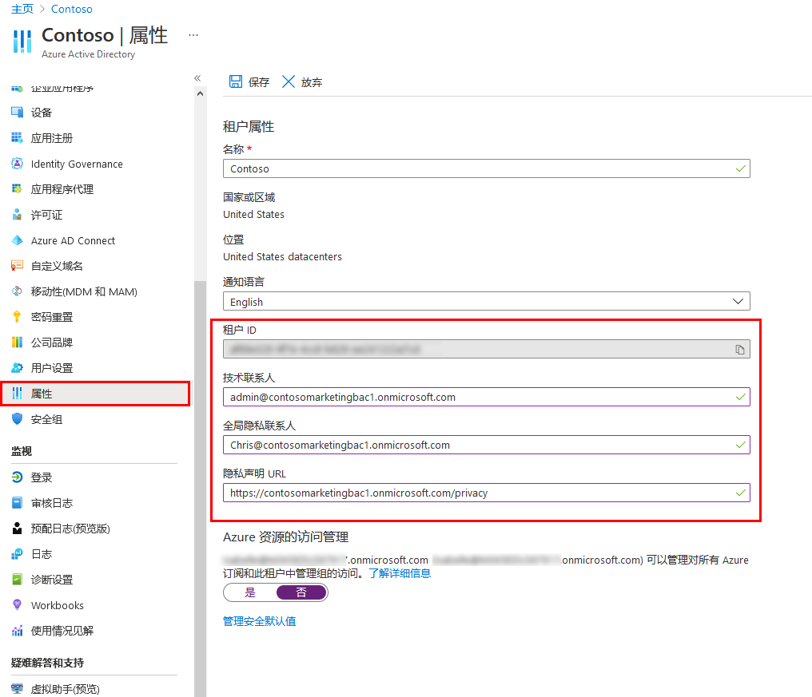
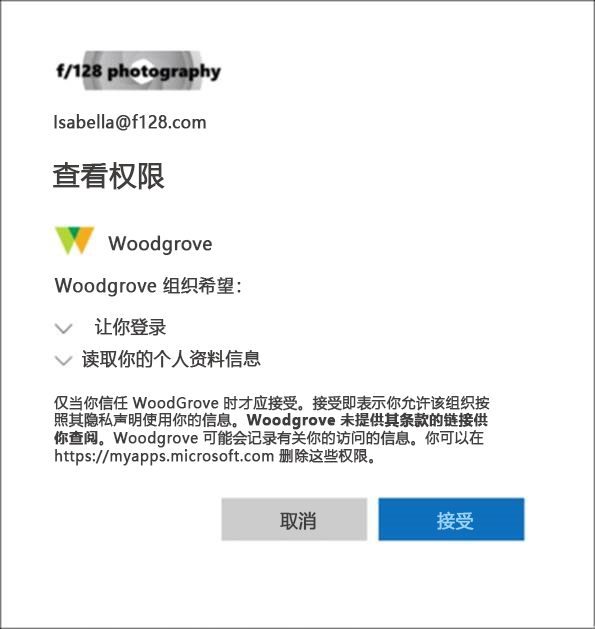

---
lab:
    title: '02 - 使用租户属性'
    learning path: '01'
    module: '模块 01 - 实现标识管理解决方案'
---

# 实验室 02：使用租户属性

## 实验室场景

你需要标识和更新与你的租户关联的不同属性。

#### 预计用时：10 分钟

## 更改租户显示名称

1. 浏览到 [https://portal.azure.com](https://portal.azure.com)，使用目录的全局管理员帐户登录。

1. 选择 **“显示门户菜单”** 汉堡图标，然后选择 **“Azure Active Directory”**。

    

1. 在左侧导航栏的“管理”部分中，选择 **“属性”**。

1. 在 **“名称”** 框中，更改租户名称。例如，可将 Contoso Marketing Company 更改为 Contoso Marketing Company 2。

1. 选择 “保存”** 以更新租户属性。

## 查找与租户关联的国家或地区

1. 在 **“Azure Active Directory”** 边栏选项卡的“管理”部分中，选择 **“属性”**。

1. 在 **“租户属性”** 下，找到 **“国家或地区”**，查看相关信息。

    > [注意事项！]
    > 国家或地区在创建租户时指定。稍后将无法更改此设置。

## 查找与租户关联的位置

正如在 Azure Active Directory “属性”边栏选项卡中查找国家或地区一样，查找位置信息的方法也是如此。

1. 在 **“属性”** 边栏选项卡中的 **“租户属性”** 下，找到 **“位置”** 并查看相关信息。

    

## 查找租户 ID

Azure 订阅与 Azure Active Directory (Azure AD) 建立了信任关系。Azure AD 是用于对订阅的用户、服务和设备进行身份验证的受信任服务。每个订阅都有一个与其关联的租户 ID，你可通过多种方式来查找订阅的租户 ID。

1. 在 **“Azure Active Directory”** 边栏选项卡的“管理”部分中，选择 **“属性”**。

1. 在 **“租户属性”** 下，找到 **“租户 ID”**。这是你的唯一租户标识符。

    

## 更改技术联系人、在 Azure AD 上添加隐私信息，其中包括全局隐私联系人和隐私声明 URL

Microsoft 强烈建议添加全局隐私联系人和组织的隐私声明，以便内部员工和外部来宾可以查看你的策略。由于隐私声明专为每个企业创建和定制，因此强烈建议你与律师联系以获取帮助。

    > [!备注]
    > 如需了解如何查看或删除个人数据，请查看 [https://docs.microsoft.com/microsoft-365/compliance/gdpr-dsr-azure](https://docs.microsoft.com/microsoft-365/compliance/gdpr-dsr-azure)。如需详细了解 GDPR，请参阅 [https://servicetrust.microsoft.com/ViewPage/GDPRGetStarted](https://servicetrust.microsoft.com/ViewPage/GDPRGetStarted)。

可以在 Azure AD 的 **“属性”** 区域中添加组织的隐私信息。访问“属性”区域并添加隐私信息：

1. 在 **“Azure Active Directory”** 边栏选项卡的“管理”部分中，选择 **“属性”**。

    

1. 为员工添加隐私信息：

- **技术联系人**。键入组织中与其联系以获得技术支持的人员的电子邮件地址。

- **全局隐私联系人**。键入与其联系以进行个人数据隐私查询的人员的电子邮件地址。此人同时也是 Microsoft 联系人，可在出现数据泄露时联系此人。如果此处未列出任何人，Microsoft 将联系全局管理员。

- **隐私声明 URL**。键入指向组织的文档的链接，该文档描述了组织如何处理内部和外部来宾的数据隐私。

    > [注意事项！]
    > 如果未包括你自己的隐私声明或隐私联系人，外部来宾将在“审阅权限”框中看到这样的文字：\<你的组织名称\>尚未提供指向供你查看的条款的链接。例如，来宾用户将在收到通过 B2B 协作访问组织的邀请时看到此消息。

    

1. 选择 **“保存”**。
