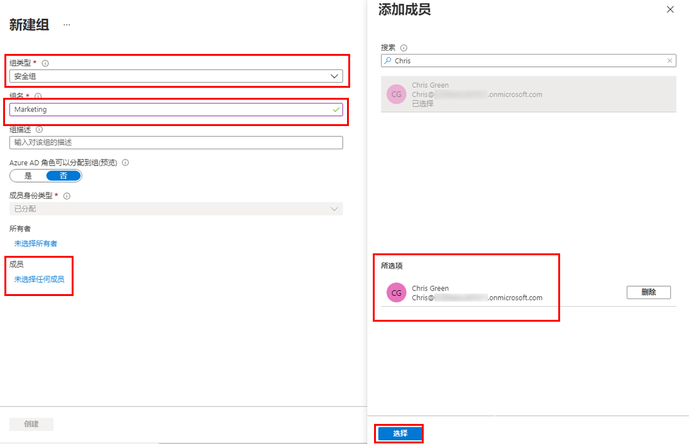
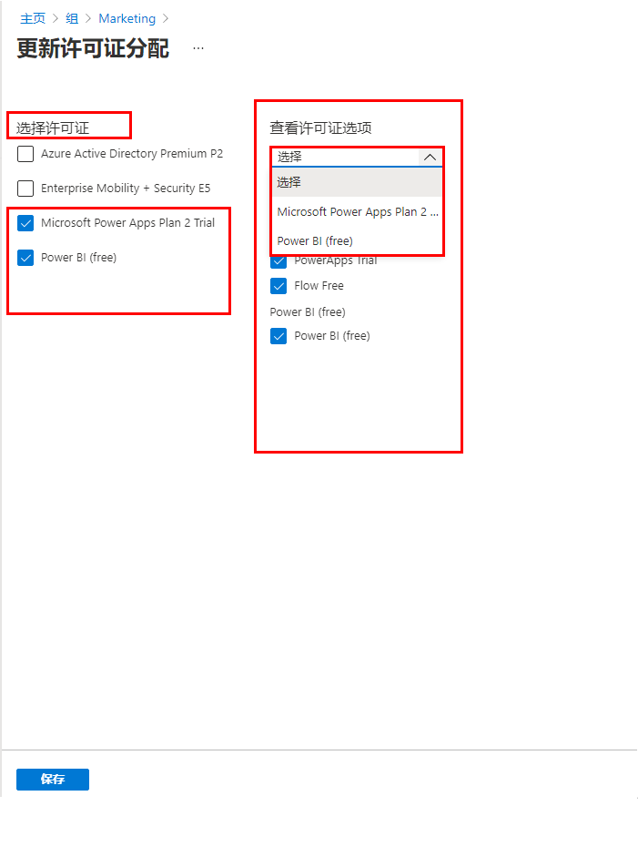

---
lab:
    title: '03 - 使用组成员身份分配许可证'
    learning path: '01'
    module: '模块 02 - 创建、配置和管理标识'
---

# 实验室 03：使用组成员身份分配许可证

## 实验室场景

你的公司决定使用 Azure AD 中的安全组来管理许可证。你需要配置新的安全组，并向该组分配许可证，验证组成员许可证是否已更新。

#### 预计用时：10 分钟

## 在 Azure Active Directory 中创建新用户

1. 浏览到 [https://portal.azure.com/#blade/Microsoft_AAD_IAM/ActiveDirectoryMenuBlade/Overview]( https://portal.azure.com/#blade/Microsoft_AAD_IAM/ActiveDirectoryMenuBlade/Overview) 并以全局管理员身份登录。

1. 在左侧导航栏的 **“管理”** 下，选择 **“用户”**。

1. 在“用户”边栏选项卡的菜单中，选择 **“新建用户”**。

1. 使用以下信息创建用户：

    | **设置**| **值**|
    | :--- | :--- |
    | 用户名| Chris|
    | Name| Chris Green|
    | 名字| Chris|
    | 姓氏| Green|
    | 密码| Pass@word1|

1. 完成后，验证 Chris Green 的帐户是否显示在 **“所有用户”** 列表中。

## 在 Azure Active Directory 中创建安全组

1. 浏览到 [https://portal.azure.com/#blade/Microsoft_AAD_IAM/ActiveDirectoryMenuBlade/Overview]( https://portal.azure.com/#blade/Microsoft_AAD_IAM/ActiveDirectoryMenuBlade/Overview).

1. 在左侧导航栏的 **“管理”** 下，选择 **“组”**。

1. 在“组”边栏选项卡的菜单中，选择 **“新建组”**。

1. 使用以下信息创建组：

    | **设置**| **值**|
    | :--- | :--- |
    | 组类型| 安全性|
    | 组名| 市场营销|
    | 成员身份类型| 已分配|
    | 所有者| *分配自己的管理员帐户作为组所有者*|
    | 成员| Chris Green|

    

1. 完成后，验证名为 **“市场营销”** 的组是否显示在 **“所有组”** 列表中。

## 向组分配许可证

1. 在 **“所有组”** 列表中，选择 **“市场营销”**。

1. 在“市场营销”边栏选项卡的 **“管理”** 下，选择 **“许可证”**。

1. 在菜单中选择 **“分配”**。

1. 在“更新许可证分配”边栏选项卡的 **“选择许可证”** 下，查看可用许可证列表，然后选中其中一个许可证对应的复选框。

1. 在 **“查看许可证”** 选项下，查看所选许可证的可用选项。

    >[!提示]
    选择多个许可证后，可使用“查看许可证选项”菜单来选择特定许可证，并查看该许可证的许可证选项。

    

1. 选择 **“保存”**。
