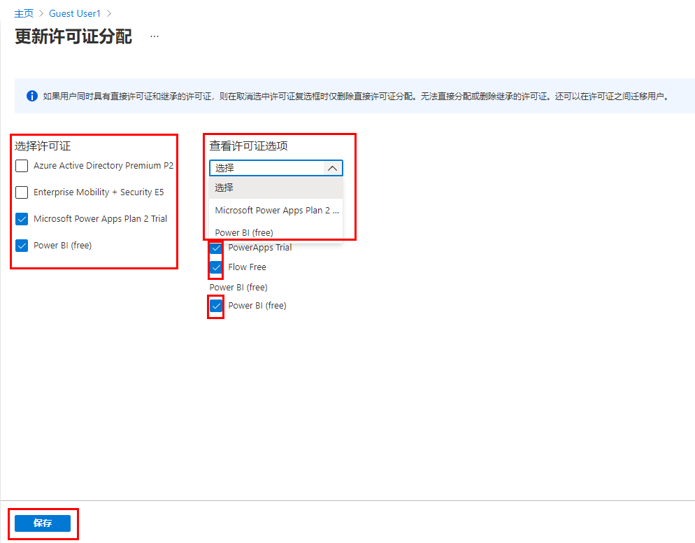

---
lab:
    title: '07 - 更改用户帐户许可证分配'
    learning path: '01'
    module: '模块 02 - 创建、配置和管理标识'
---

# 实验室 07：更改用户帐户许可证分配

## 实验室场景

组织中的一些用户帐户将不会获得其分配的许可证中的所有可用产品或将需要其许可证分配的更新或附加。需要确保能够在 Azure AD 中更新用户帐户的许可证分配。

#### 预计用时：5 分钟

## 在 Azure Active Directory 中创建新用户

1. 浏览到 [https://portal.azure.com/#blade/Microsoft_AAD_IAM/ActiveDirectoryMenuBlade/Overview]( https://portal.azure.com/#blade/Microsoft_AAD_IAM/ActiveDirectoryMenuBlade/Overview).

1. 在左侧导航栏的 **“管理”** 下，选择 **“用户”**。

1. 在“用户”边栏选项卡的菜单中，选择 **“新建用户”**。

1. 使用以下信息创建用户：

    | **设置**| **值**|
    | :--- | :--- |
    | 用户名| Dominique|
    | 姓名| Dominique Koch|
    | 名字| Dominique|
    | 姓氏| Koch|
    | 密码| Pass@word1|
    | 使用位置| *选择首选使用位置*|

    >警告
    >若要向用户分配许可证，必须为用户分配使用位置。

1. 完成后，验证 Chris Green 的帐户是否显示在 **“所有用户”** 列表中。

## 更新用户许可证分配

1. 浏览到 [https://portal.azure.com/#blade/Microsoft_AAD_IAM/ActiveDirectoryMenuBlade/Overview]( https://portal.azure.com/#blade/Microsoft_AAD_IAM/ActiveDirectoryMenuBlade/Overview).

1. 在左侧导航栏的 **“管理”** 下，选择 **“用户”**

1. 在“用户”边栏选项卡中，选择 **“Dominique Koch”**。

1. 在左侧导航栏中，选择 **“许可证”**。

1. 在“更新许可证分配”边栏选项卡上，选中单个或多个许可证的复选框。

    

1. 完成后选择 **“保存”**。
