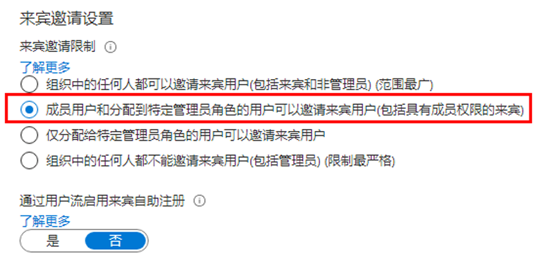

---
lab:
    title: '08 - 配置外部协作设置'
    learning path: '01'
    module: '模块 03 - 实现和管理外部标识'
---

# 实验室 08：配置外部协作设置

## 实验室场景

必须为组织启用外部协作设置以进行批准的来宾访问。

#### 预计用时：5 分钟

### 配置外部协作设置

1. 以租户管理员身份登录到 [https://portal.azure.com](https://portal.azure.com)。

1. 选择 **“Azure Active Directory”**。

1. 选择 **“外部标识” > “外部协作设置”**。

1. 在 **“来宾用户访问权限”** 下，查看可用的访问级别，然后选择 **“来宾用户访问权限仅限于自己的目录对象的属性和成员身份(限制最严格)”**。

    > [!备注]
    >
    >- 来宾用户具有与成员相同的访问权限（最具包容性）：此选项为来宾提供与成员用户相同的对 Azure AD 资源和目录数据的访问权限。
    >- 来宾用户对目录目标的属性和成员身份具有有限的访问权限：（默认）此设置可阻止来宾执行某些目录任务，如枚举用户、组或其他目录资源。来宾可以看到所有非隐藏组的成员身份。
    >- 来宾用户访问仅限于其自己的目录目标的属性和成员身份（最具限制性）：使用此设置，来宾只能访问自己的个人资料。来宾不能看到其他用户的个人资料、组或组成员身份。

    

1. 在“来宾邀请设置”下，选择“成员用户和分配给特定管理员角色的用户可以邀请来宾用户，包括具有成员权限的来宾”****

    > [!备注]
    > 管理员和具有“来宾邀请者”角色的用户可以邀请：若要允许管理员和具有“来宾邀请者”角色的用户邀请来宾，请将此策略设置为“是”。
    > 成员可邀请：若要允许目录的非管理员成员邀请来宾，请将此策略设置为“是”。
    > 来宾可邀请：若要允许来宾邀请其他来宾，请将此策略设置为“是”。
    > 通过用户流启用来宾自助注册（预览版）：通过与目录中的应用程序关联的用户流来启用或禁用来宾自助注册。禁用时，需要将来宾邀请到目录。
    > 如果将“成员可以邀请”设置为“否”，并且将“管理员和具有“来宾邀请者”角色的用户可以邀请”设置为“是”，则具有来宾邀请者角色的用户仍可邀请来宾。

    

1. 在 **“协作限制”** 下，查看可用选项并接受默认设置。

    > [注意事项！]
    > 可以创建允许列表或拒绝列表。不能同时设置这两种类型的列表。默认情况下，不在允许列表中的任何域都会包含在拒绝列表中，反之亦然。
    > 对于每个组织，只能创建一个策略。可以更新策略以包含更多的域，或者删除策略以创建新策略。
    > 可以添加到允许列表或拒绝列表的域数目仅受策略大小限制。整个策略的最大大小是 25 KB （25,000 个字符），这包括允许列表或拒绝列表以及任何为其他功能配置的其他参数。
    > 此列表独立于 OneDrive for Business 和 SharePoint Online 允许/阻止列表。若要在 SharePoint Online 中限制单个文件的共享，需要为 OneDrive for Business 和 SharePoint Online 设置允许或拒绝列表。
    > 此列表不适用于已兑换邀请的外部用户。设置列表后，将强制实施该列表。如果用户邀请处于挂起状态，而你设置了一个阻止该用户的域的策略，则该用户在尝试兑换邀请时将会失败。

1. 完成后，保存所做的更改。
