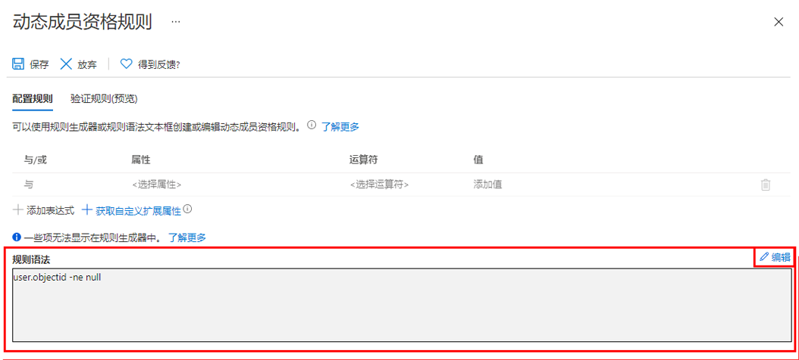

---
lab:
    title: '11 - 使用动态组'
    learning path: '01'
    module: '模块 03 - 实现和管理外部标识'
---

# 实验室 11：使用动态组

## 实验室场景

随着公司发展，手动组管理过于耗时。由于对目录进行了标准化，现在可以利用动态组。必须创建新的动态组以确保准备好在生产环境中创建动态组。

#### 预计用时：10 分钟

## 创建其成员包含所有用户的动态组

1. 使用分配有租户中的全局管理员或用户管理员角色的帐户登录 [https://portal.azure.com](https://portal.azure.com)。

1. 选择 **“Azure Active Directory”**。

1. 在 **“管理”** 下，选择 **“组”**，然后选择 **“新建组”**。

1. 在“新建组”页面的 **“组类型”** 下，选择 **“安全性”**。

1. 在 **“组名”** 框中，输入 **“所有公司用户动态组”**。

1. 选择 **“成员身份类型”** 菜单，然后选择 **“动态用户”**。

1. 在 **“动态用户成员”** 下，选择 **“添加动态查询”**。

1. 在 **“规则语法”** 框上方的右侧，选择 **“编辑”**。

1. 在“编辑规则语法”窗格中的 **“规则语法”** 框中输入以下表达式：

    ```powershell
    user.objectId -ne null
    ```

1. 选择 **“确定”**。规则会出现在“规则语法”框中。

    

1. 选择 **“保存”**。新的动态组现在包括 B2B 来宾用户以及成员用户。

1. 在“新建组”页上，选择 **“创建”** 以创建组。
