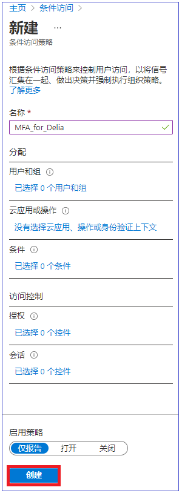
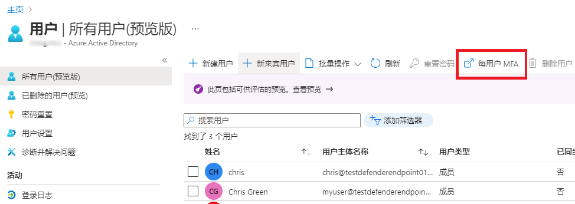
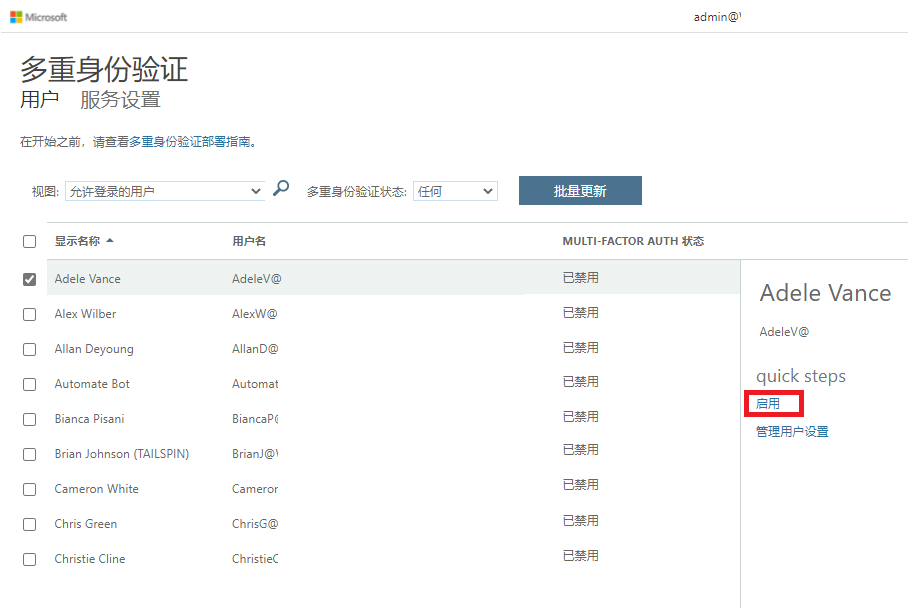

---
lab:
    title: '12 - 启用 Azure AD 多重身份验证'
    learning path: '02'
    module: '模块 01 - 计划和实现 Azure 多重身份验证'
---

# 实验室 12 - 启用 Azure AD 多重身份验证

## 实验室场景

为了提高组织中的安全性，你被要求启用 Azure Active Directory 的多重身份验证。

#### 预计用时：10 分钟

>[!重要说明]
>此练习需要 Azure AD Premium。可以使用 30 天的免费试用版来试用此功能，或者仅阅读以下说明以了解流程。

## 配置多重身份验证选项

1. 浏览到 [https://portal.azure.com](https://portal.azure.com)，使用目录的全局管理员帐户登录。

1. 使用搜索功能，搜索 **“多重身份验证”**。

1. 在搜索结果中，选择 **“多重身份验证”**。

1. 在“开始使用”页面中的 **“配置”** 下，选择 **“其他基于云的 MFA 设置”**。

    

1. 在新的浏览器页面中，可看到适用于 Azure 用户的 MFA 选项和服务设置。

    

    可以在此处选择受支持的身份验证方法，在上面的屏幕中，所有方法均已选中。

    还可以在此处启用或禁用应用密码，以使用户可以为不支持多重身份验证的应用创建唯一的帐户密码。此功能使用户可以使用特定于该应用的其他密码通过其 Azure AD 标识进行身份验证。

## 设置 MFA 的条件访问规则

接下来，让我们研究如何设置条件访问策略规则，此类规则将对访问网络上的特定应用的来宾用户强制执行 MFA。

1. 切换回 Azure 门户并依次选择 **“Azure Active Directory”** > **“安全性”** > **“条件访问”**。

1. 在菜单中选择 **“新建策略”**。

    

1. 为策略命名，例如 **“所有来宾”**。

1. 选择 **“用户和组”**。

    - 选择 **“选择用户和组”**  
    - 选中 **“所有来宾和外部用户”** 复选框，以将其应用于所有来宾。  
    - 选择 **“完成”**。  

1. 选择 **“云应用或操作”**。

    - 选择 **“选择应用”**。  
    - 选择要启用 Azure AD MFA 的应用，例如，Visual Studio App Center。  
    - 选择 **“选择”**，然后选择 **“完成”**。

1. 查看“条件”部分。

    - 选择 **“位置”**，然后将其配置为 **“任意位置”**。

1. 在 **“访问控制”** 下，选择 **“授予”**，然后验证是否已选择 **“授予访问权限”**。

1. 选中 **“需要多重身份验证”** 复选框以强制实施 MFA。

1. 选择 **“选择”**。

1. 将 **“启用策略”** 设置为 **“开”**。

1. 选择 **“创建”** 创建策略。

    

    现在已为所选应用程序启用了 MFA。下次来宾尝试登录该应用时，系统将提示他们注册 MFA。

## 为密码配置 Azure AD MFA

最后，我们介绍如何为用户帐户配置 MFA。这是获取多重身份验证设置的另一种方法。

1. 切换回 Azure 门户中的 “Azure Active Directory” 仪表板。

1. 选择 **“用户”**。

1. 在“用户”窗格的顶部，选择 **“多重身份验证”**。

    

    可以通过选择一位用户，然后使用右侧的快捷步骤，为用户启用或禁用 MFA。

    

1. 选择**网站设置**。  
    这会显示与我们之前看到的相同的全局 MFA 选项。让我们更详细地探讨这些内容。
