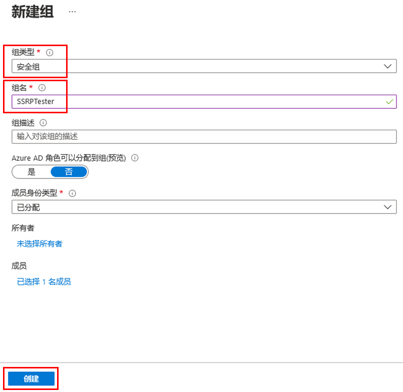
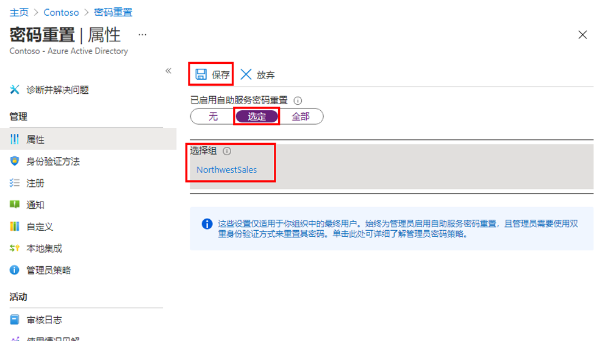
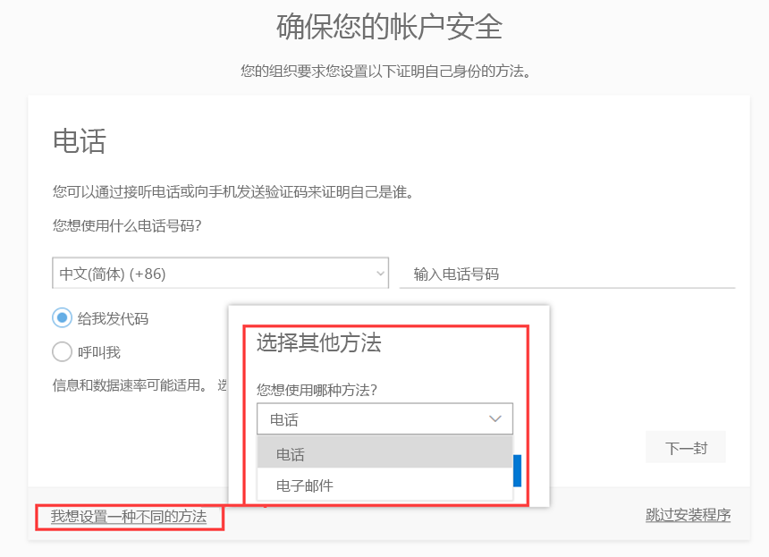
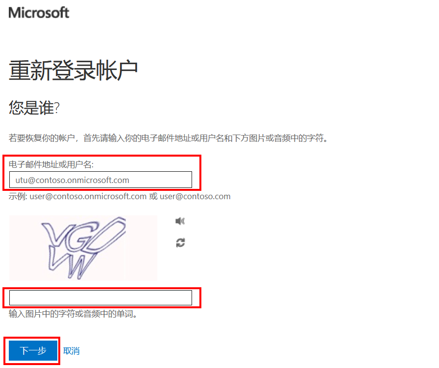
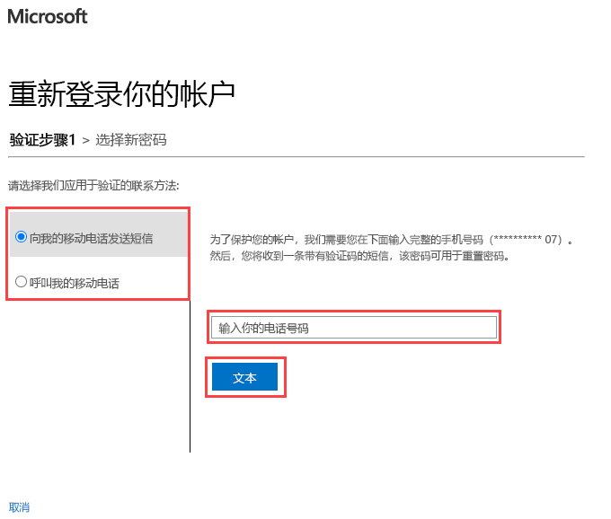

---
lab:
    title: '13 - 配置和部署自助式密码重置'
    learning path: '02'
    module: '模块 02 - 管理用户身份验证'
---

# 实验室 13 - 配置和部署自助式密码重置

## 实验室场景

公司已决定为员工提供支持，并启用自助式密码重置。你需要在组织中配置此设置。

#### 预计用时：15 分钟

## 添加新用户

1. 使用全局管理员帐户登录到 [https://portal.azure.com](https://portal.azure.com)。

1. 打开门户菜单，然后选择 **“Azure Active Directory”**。

1. 在创建的 Azure AD 组织中，在 **“管理”** 下选择 **“用户”** > **“新建用户”**。

1. 此时会显示“用户”窗格。输入以下值：

- **用户名**： Utu

- **姓名**： Utu Linna

1. 选择 **“显示密码”**，然后复制该密码以便稍后引用。

1. 选择 **“创建”**。

## 创建组

需要先向人数有限的一组用户推送 SSPR，以确保 SSPR 配置按预期工作。我们先来创建一个用于部分推广的安全组，并向该组添加用户。

1. 在“Azure Active Directory”边栏选项卡的 **“管理”** 下，选择 **“+ 新建组”**。

1. 使用以下信息创建新组：

    | **设置**| **值**|
    | :--- | :--- |
    | 组类型| 安全性|
    | 组名| SSPRTesters|
    | 组说明| SSPR 推广测试人员|
    | 成员身份类型| 已分配|
    | 成员| Utu Linna|
    
1. 选择 **“创建”**。

    

## 启用 SSPR

为组启用 SSPR。

1. 浏览回 “Azure Active Directory” 边栏选项卡。

1. 在 **“管理”** 下，选择 **“密码重置”**。

    >备注
    >如果“密码重置”页面仍显示消息“获取免费高级试用版才能使用此功能”，请等待几分钟，然后刷新页面。
    >在“密码重置”边栏选项卡的“属性”页上，在 **“已启用自助式密码重置”** 下，选择 **“选定”**。

1. 选择 **“选择组”**。

1. 在默认密码重置策略窗格中，选择 **“SSPRTesters”** 组。

1. 在“密码重置”边栏选项卡的“属性”页上，选择 **“保存”**。

    

1. 在 **“管理”** 下，选择并查看 **“身份验证方法”**、**“注册”**、**“通知”** 和 **“自定义”** 设置的默认值。

## 注册 SSPR

现在已完成 SSPR 配置，接下来可以为创建的用户注册移动电话号码。

1. 打开其他浏览器或打开 InPrivate 或 Incognito 浏览器会话，然后浏览到 [https://aka.ms/ssprsetup](https://aka.ms/ssprsetup)。

    这是为了确保系统能提示你进行用户身份验证。

1. 以 **uta@***organization-domain-name***.onmicrosoft.com** 和前面记下的密码进行登录。

1. 将 organization-domain-name 替换为自己的域名。

1. 如果系统要求更新密码，请按需要输入新密码。请确保记下新密码。

1. 在 **“需要更多信息”** 对话框中，选择 **“下一步”**。

1. 在“保护帐户安全”页上，使用 **“电话”** 选项或选择 **“我想要设置其他方法”** 链接。

    

1. 在本示例中，你将使用 **“电话”** 选项。输入移动电话详细信息。

1. 选择 **“以短信形式向我发送验证码”**。

1. 在移动电话上收到验证码后，在文本框中输入该验证码，然后选择 **“下一步”**。

1. 注册手机后，依次选择 **“下一步”** 和 **“完成”**。

1. 关闭浏览器。无需完成登录过程。

## 测试 SSPR

现在来测试用户是否可以重置其密码。

1. 打开其他浏览器或打开 InPrivate 或 Incognito 浏览器会话，然后浏览到 [https://aka.ms/ssprsetup](https://aka.ms/ssprsetup)。

    这是为了确保系统能提示你进行用户身份验证。

1. 在 **“电子邮件”**、**“电话”**、或 **“Skype”** 框中，输入 **uta@***organization-domain-name***.onmicrosoft.com**，然后选择 **“下一步”**。

1. 将 organization-domain-name 替换为自己的域名。

1. 在“输入密码”页上，选择 **“忘记密码”**。

1. 在“重新登录帐户”页上，填写要求填写的信息，然后选择 **“下一步”**。

    

1. 在 **“验证步骤 1”** 任务中，选择 **“向我的移动电话发短信”** 或 **“呼叫我的移动电话”**，输入电话号码，然后选择 **“发短信”**。

    

1. 输入验证码，然后选择 **“下一步”**。

1. 在“选择新密码”步骤中，输入并确认新密码。

1. 完成后，选择 **“完成”**。

1. 以 **Utu** 的身份使用创建的新密码登录。

1. 输入验证码，然后验证是否可以完成登录过程。

1. 完成后，关闭浏览器。
