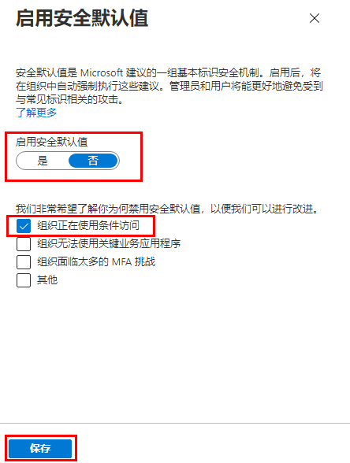

---
lab:
    title: '14 - 使用安全默认值'
    learning path: '02'
    module: '模块 03 - 计划、实现和管理条件访问'
---

# 实验室 14 - 使用安全默认值

## 实验室场景

你需要在组织中配置 Azure Active Directory 安全默认值设置。

#### 预计用时：5 分钟

## 启用安全默认值

若要在目录中启用安全默认值，请执行以下操作：

1. 浏览到 [https://portal.azure.com](https://portal.azure.com)，使用目录的全局管理员帐户登录。

1. 选择 **“显示门户菜单”** 汉堡图标，然后选择 **“Azure Active Directory”**。

    

1. 在左侧导航栏的“管理”部分中，选择 **“属性”**。

1. 在“属性”边栏选项卡底部，选择 **“管理安全默认值”**。

1. 将 **“启用安全默认值”** 切换开关设置为 **“是”**。

1. 可能已启用此选项。

1. 选择 **“保存”**。

### 禁用安全默认值

选择实现条件访问策略来取代安全默认值的组织必须禁用安全默认值。

若要在目录中禁用安全默认值，请执行以下操作：

1. 浏览到 [https://portal.azure.com](https://portal.azure.com/)，使用目录的全局管理员帐户登录。

1. 选择 **“显示门户菜单”** 汉堡图标，然后选择 **“Azure Active Directory”**。

1. 在“属性”边栏选项卡底部，选择 **“管理安全默认值”**。

1. 将 **“启用安全默认值”** 切换开关设置为 **“否”**。

    

1. 选择 **“保存”**。
