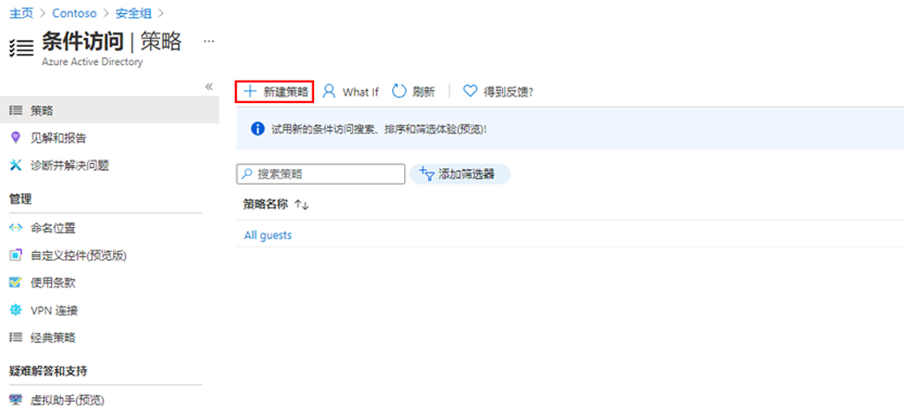
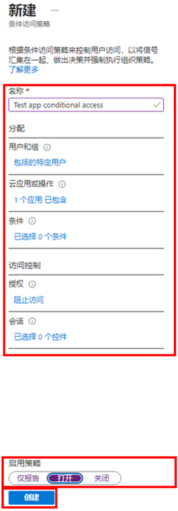

---
lab:
    title: '15 - 实现和测试条件访问策略'
    learning path: '02'
    module: '模块 03 - 计划、实现和管理条件访问'
---

# 实验室 15 - 实现和测试条件访问策略

## 实验室场景

你的组织需要能够限制用户对其内部应用程序的访问。你需要部署 Azure Active Directory 条件访问策略。

#### 预计用时：10 分钟

## 创建条件访问策略

Azure Active Directory 条件访问是一项 Azure AD 高级功能，可用于指定控制谁可以访问资源的详细策略。使用条件访问，可以通过基于组、设备类型、位置和角色等限制用户的访问来保护应用程序。

1. 浏览到 [https://portal.azure.com](https://portal.azure.com)，使用目录的全局管理员帐户登录。

1. 打开门户菜单，然后选择 **“Azure Active Directory”**。

1. 在 “Azure Active Directory” 边栏选项卡的 **“管理”** 下，选择 **“安全性”**。

1. 在“安全性”边栏选项卡的左侧导航栏中，选择 **“条件访问”**。

1. 在顶部菜单中选择 **“新建策略”**。

    

1. 在 **“名称”** 框中，输入 **“Yammer 条件访问”**。

1. 这是本练习所使用的名称，你可以根据需要选择其他名称。

1. 在 **“分配”** 下，选择 **“用户和组”**。

1. 在“包括”选项卡上，选中 **“用户和组”** 复选框。

1. 在“选择”窗格中，选择你的管理员帐户，然后选择 **“选择”**。

1. 选择 **“云应用或操作”**。

1. 确认已选择 **“云应用”**，然后选择 **“选择应用”**。

1. 在“选择”窗格中，选择 **“Office 365 Yammer”**，然后选择 **“选择”**。

1. 选择 **“条件”**，然后选择 **“条件”**。

1. 在 **“配置”** 下，选择 **“是”**，然后选择 **“任何位置”**。

1. 在 **“访问控制”** 下，选择 **“授予”**。

1. 在“授予”窗格中，选择 **“阻止访问”**，然后选择 **“选择”**。

    >备注
    >此策略配置为仅用于练习，用于快速演示条件访问策略。

1. 在 **“启用策略”** 下，选择 **“启用”**，然后选择 **“创建”**。

    

## 测试条件访问策略

你应该测试条件访问策略，以确保它们按预期工作。

1. 打开一个新的浏览器标签页，然后浏览到 [https://www.yammer.com/office365](https://www.yammer.com/office365)。

     应传递你的凭据。

1. 验证你已成功阻止访问 Microsoft Yammer。

    

1. 如果已登录，请关闭该选项卡，等待 1-2 分钟，然后重试。

1. 关闭选项卡并返回到“条件访问”边栏选项卡。

1. 选择 **“Yammer 条件访问”** 策略。

1. 在 **“启用策略”** 下，选择 **“禁用”** ，然后选择 **“保存”**。
