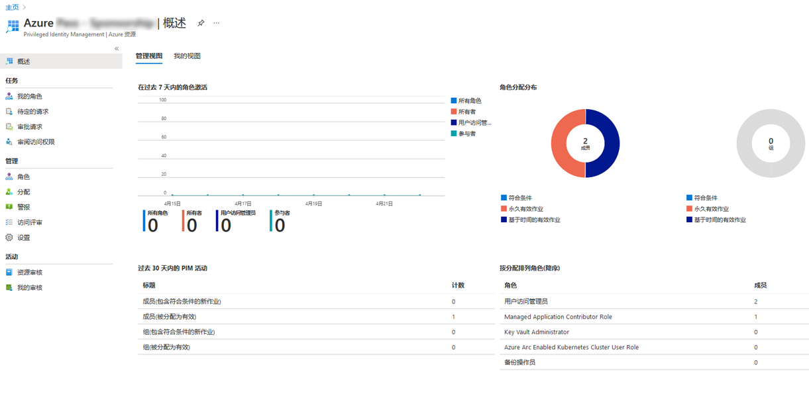

---
lab:
    title: '30 - 在 Privileged Identity Management 中分配 Azure 资源角色'
    learning path: '04'
    module: '模块 03 - 计划和实现权利管理'
---

# 实验室 30： 在 Privileged Identity Management 中分配 Azure 资源角色

## 实验室场景

Azure Active Directory (Azure AD) Privileged Identity Management (PIM) 可以管理内置的 Azure 资源角色以及自定义角色，包括（但不限于）：

- 所有者

- 用户访问权限管理员

- 参与者

- 安全管理员

- 安全管理者

你需要使用户符合 Azure 资源角色的条件。

#### 预计用时：10 分钟

## 分配 Azure 资源角色

1. 使用全局管理员帐户登录到 [https://portal.azure.com](https://portal.azure.com)。

1. 搜索并选择 **“Azure AD Privileged Identity Management”**。

1. 在 “Privileged Identity Management” 边栏选项卡的左侧导航窗格中，选择 **“Azure 资源”**。

1. 在顶部菜单中选择 **“发现资源”**。

1. 在 “Azure 资源 - 发现”边栏选项卡中，选择订阅，然后在顶部菜单中选择 **“管理资源”**。

    

1. 在 **“加入要管理的所选资源”** 对话框中，查看信息，然后选择 **“确定”**。

1. 加入完成后，关闭 “Azure 资源 - 发现”边栏选项卡。

1. 在 “Azure 资源”边栏选项卡中，选择刚添加的资源。

    

1. 在左侧导航菜单的 **“管理”** 下，选择 **“角色”**，查看适用于 Azure 资源的角色列表。

1. 在顶部菜单中，选择 **“+ 添加分配”**。

1. 在“添加分配”边栏选项卡中，选择 **“选择角色”** 菜单，然后选择 **“API 管理服务参与者”**。

1. 在 **“选择成员”** 下，选择 **“未选择任何成员”**。

1. 在“选择成员或组”窗格中，选择组织中将向其分配角色的帐户。

1. 选择 **“下一步”**。

1. 在 **“设置”** 选项卡的 **“分配类型”** 下，选择 **“符合条件”**。

    - **“符合条件”** 的分配要求该角色的成员执行某个操作才能使用该角色。操作可能包括执行多重身份验证 (MFA) 检查、提供业务理由或请求获得指定审批者的批准。

    - **“活动”** 分配不要求该角色的成员执行任何操作便可使用该角色。分配为“活动”的成员拥有始终分配给该角色的特权。

1. 通过更改开始和结束日期和时间来指定分配持续时间。

1. 完成后，选择 **“保存”**。

1. 创建新的角色分配后，将显示状态通知。

## 更新或删除现有资源角色分配

按照以下步骤更新或删除现有的角色分配。

1. 打开 **“Azure AD Privileged Identity Management”**。

1. 选择 **“Azure 资源”**。

1. 选择要管理的资源，以打开其概述页。

1. 在 **“管理”** 下，选择 **“分配”**。

1. 在 **“符合条件的角色”** 选项卡的“操作”列中，查看可用选项。

1. 选择 **“删除”**。

1. 在 **“删除”** 对话框中，查看信息，然后选择 **“是”**。
