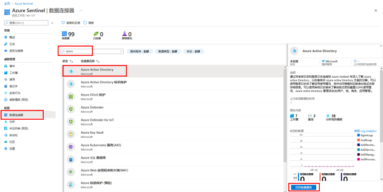

---
lab:
    title: '31 - 将数据从 Azure Active Directory (Azure AD) 连接到 Microsoft Sentinel'
    learning path: '04'
    module: '模块 04 - 监视和维护 Azure Active Directory'
---

**备注 - 该实验室将于 2 月 4 日从 SC-300 实验室停用。  我们将在不久的将来推出一个更有趣的实验室来介绍 Microsoft Sentinel。  如果你正在教授 SC-300 课程，可以选择包含或排除此实验室。  如果你确实要使用它，学生将需要设置 Azure Pass 和订阅。**

# 实验室 31：将数据从 Azure Active Directory (Azure AD) 连接到 Microsoft Sentinel

## 实验室场景

你所在的公司希望开始使用安全信息和事件管理 (SIEM) 解决方案。你知道你有权访问 Microsoft Sentinel，并且需要熟悉如何将其连接到 Azure AD。

#### 预计用时：10 分钟

## 先决条件

- 任何 Azure AD 许可证（免费/O365/P1/P2）都足以将登录日志引入 Microsoft Sentinel。对于 Azure Monitor (Log Analytics) 和 Azure Sentinel，可能会收取额外的每 GB 费用。

- 必须在工作区中为用户分配 Microsoft Sentinel 参与者角色。

- 必须在要从中流式传输日志的租户上为用户分配全局管理员或安全管理员角色。

- 用户必须对 Azure AD 诊断设置具有读取和写入权限才能查看连接状态。

## 创建和添加 Microsoft Sentinel 工作区

如果还没有可用于 Microsoft Sentinel 的工作区，请使用这些说明。

1. 使用全局管理员帐户登录到 [https://portal.azure.com](https://portal.azure.com)。

2. 搜索 **Microsoft Sentinel** 并将其选中。

3. 在“Microsoft Sentinel 工作区”边栏选项卡中，在菜单上选择“**+ 创建**”。

4. 如果已有 Microsoft Sentinel 工作区，则可以选择该工作区，并继续执行下一个任务。

5. 在“将 Microsoft Sentinel 添加到工作区”边栏选项卡中，选择“**创建新工作区**”。

6. 使用以下信息来创建新的 Log Analytics 工作区：

    | 设置| 值|
    | :--- | :--- |
    | 订阅| 使用当前订阅。|
    | 资源组| 使用现有资源组，或创建一个新的资源组。|
    | 名称| **Lab-workspace-yourinitialsanddate** 工作区必须是全局唯一的值。|
    | 定价层| 即用即付（根据 GB 2018） |

7. 选择“**查看 + 创建**”。
8. 显示“**已通过验证**”消息后，选择“**创建**”。

9. 完成后，选择新工作区，然后选择“**添加**”以将工作区添加到 Microsoft Sentinel。

## 连接到 Azure Active Directory

可以使用 Microsoft Sentinel 的内置连接器从 [https://docs.microsoft.com/zh-cn/azure/active-directory/fundamentals/active-directory-whatis](https://docs.microsoft.com/zh-cn/azure/active-directory/fundamentals/active-directory-whatis) 收集数据，并将其流式传输到 Azure Sentinel。通过连接器，可以流式传输 [https://docs.microsoft.com/zh-cn/azure/active-directory/reports-monitoring/concept-sign-ins](https://docs.microsoft.com/zh-cn/azure/active-directory/reports-monitoring/concept-sign-ins) 和 [https://docs.microsoft.com/zh-cn/azure/active-directory/reports-monitoring/concept-audit-logs](https://docs.microsoft.com/zh-cn/azure/active-directory/reports-monitoring/concept-audit-logs)。

1. 在 Microsoft Sentinel 的左侧导航菜单中的“**配置**”下，选择“**数据连接器**”。

1. 在“**数据连接器**”列表中，选择“**Azure Active Directory**”，然后选择“**打开连接器页**”。

    

1. 在“**配置**”下，选择“**Azure Active Directory 登录日志**”和“**审核日志**”复选框，然后选择“**应用更改**”。

    

1. 关闭“Azure Active Directory 连接器”页。
